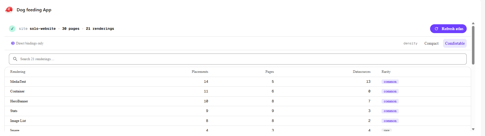
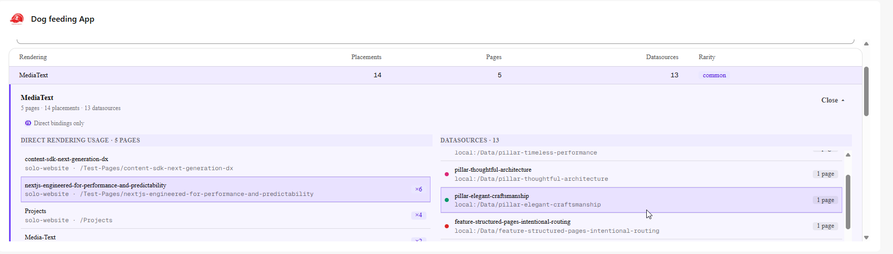
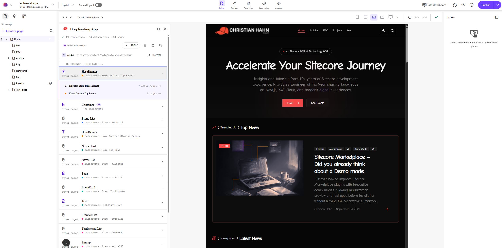
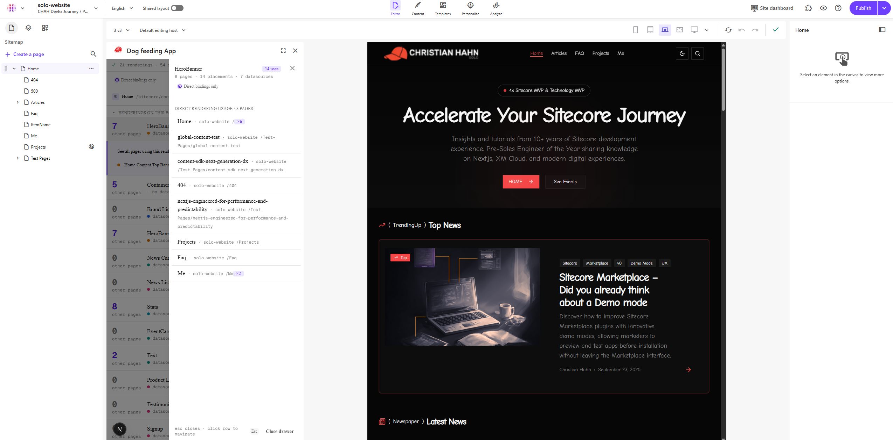

# Component Usage Atlas

Tenant-wide live atlas of where renderings and their bound datasources are used
across a Sitecore tenant — a Marketplace app for content editors. Two surfaces
ship from one app registration: a **Dashboard Widget** for component-centric
search, and a **Page Context Panel** for page-centric impact analysis. The atlas
is built fresh in the iframe heap on demand, cached for the tab's lifetime, and
discarded on tab close. No backend, no persisted index, no scheduled jobs.

## Screenshots

Captured from a live XM Cloud tenant (Christian Hahn solo-website, "Dog feeding
App" registration). One Marketplace app, two surfaces.

### Dashboard Widget — `xmc:dashboardblocks`

Search-first table of every rendering in the host site, sorted by total
placements. Each row shows placements, distinct pages, datasource count, and a
rarity badge. The freshness ribbon at the top names the host site (`site
solo-website`) and the totals from the last completed scan; the `Refresh atlas`
button replays the scan with the same scope.



Click a row to inline-expand the detail block beneath it. Two columns scroll
independently as the lists grow: **left** is `Direct rendering usage · N pages`
(every page binding this rendering, with a `×N` badge per page when there's
more than one placement on that page); **right** is `Datasources · M`
(every datasource bound by any placement of this rendering, color-tagged for
cross-row hover affinity). Hovering a datasource on the right highlights the
matching pages on the left.



### Page Context Panel — `xmc:pages:context-panel`

For the active page, lists every rendering on it. Each row pairs a
cross-tenant `+N other pages` counter with the rendering name and the
datasource it binds (color-tagged with a path hint or short-id fallback).
Identical placements (same rendering + same datasource) collapse into one
row with a `×N` badge so a 12-Container page reads as a 1-row entry, not a
12-row scroll. Clicking a row expands a nested affordance: "See all pages
using this rendering →" opens the per-rendering drawer; the datasource line
opens the per-datasource drawer (cross-tenant pages binding it).



The per-rendering drawer answers the *"if I publish this, what else
breaks?"* question without leaving the active page: full page list with
per-page placement count, a `× page-count` summary pill, and the locked
`Direct bindings only` affordance so the editor knows the scope of the
result. Clicking a page row routes Pages to that page via
`client.mutate('pages.context')` — no full reload, no lost editor state.



## What this does

Sitecore content editors regularly hit the same blind spot: *"if I publish,
modify, or delete this rendering — or this datasource — what else breaks?"*
Native Pages does not surface cross-page rendering and datasource usage in a
fast, in-context way. Component Usage Atlas closes that gap by walking the
tenant's `xmc.agent.*` endpoints on demand and aggregating the results into
two views:

- **Dashboard Widget** (`xmc:dashboardblocks`) — search any rendering, see
  every page that uses it, drill into per-page detail with a side drawer.
- **Page Context Panel** (`xmc:pages:context-panel`) — for the active page,
  list its renderings with `+N other pages` counters, plus a Datasource Impact
  group that does the same for every datasource referenced from this page.

The app is **pull-only** by design (the Marketplace SDK does not allow apps to
intercept publish or delete actions in Pages) and the atlas is **fully live in
the iframe** — installed once, no infrastructure to maintain.

**PRD-001 (2026-05-05) — Atlas Snapshot Export.** Each surface now hosts a
format picker (JSON / CSV / HTML) followed by a three-action cluster: **Save**,
**Open in new tab**, **Copy to clipboard**. Editors can take a portable
snapshot of the atlas out of the iframe — to diff across time, share with
stakeholders without XM Cloud access, or feed into spreadsheets / BI tools /
refactor scripts. Save renders disabled in the current Cloud Portal iframe
sandbox (downloads aren't yet allowed by the host); Open and Copy are
primary, mirroring the same pattern shipped in the sibling Pageshot product.
HTML output is print-stylesheet-ready so editors can hit Ctrl+P → Save as PDF
for a shareable artifact in two clicks. See **CHANGELOG.md** and
**ADR-0021** for the full architecture story.

## Tech stack

- **Next.js 16.1.7** (App Router, Turbopack)
- **React 19.2**
- **TypeScript** (strict)
- **Tailwind CSS v4** + **Blok** semantic-token registry (Sitecore design system)
- **`@sitecore-marketplace-sdk/client@0.3.2`** + **`@sitecore-marketplace-sdk/xmc@0.4.1`** (pinned)
- **Vitest 4.x** + **@testing-library/react** + **jsdom** — covering scan engine, atlas state, surface composition, drawers, format adapters (JSON / CSV / HTML), egress hooks, telemetry conformance, schema-stability, and SDK fixtures with `// source:` provenance per `40-sdk-contracts.mdc`. Run `npm run test` for the live count.
- **Sonner** (Blok-styled toaster) — installed via shadcn registry for cross-cutting failure surfaces (per ADR-0021 toasts only fire for blob-construction failures, not per-action blocks).
- **Mode A iframe-only** — no backend, no persistence, no external network egress.

## Getting started

Prerequisites: Node 22+ and a working `npm`. From the product root:

```bash
cd site
npm install
```

### Run locally

```bash
npm run dev
```

Then open one of the surface routes directly:

- `http://localhost:3000/widget` — Dashboard Widget surface
- `http://localhost:3000/panel` — Page Context Panel surface

## Local smoke-test rule

Always hit one of the surface routes directly. The application root `/` returns
Next.js `notFound()` by design (see `docs/decisions.md` ADR-0014); a 404 there
is correct, not a bug.

```bash
cd products/component-usage-atlas/site
npm run dev
# then open ONE of:
#   http://localhost:3000/widget   ← Dashboard Widget surface
#   http://localhost:3000/panel    ← Page Context Panel surface
# DO NOT open http://localhost:3000/  — it is unreachable on purpose.
```

Outside the Cloud Portal iframe the `MarketplaceProvider` shows its connecting
loader and never resolves — that is expected. To exercise the real handshake,
install the app into a Cloud Portal tenant and load the surface from inside the
portal.

### Tests, lint, build, audits

```bash
npm run lint                 # ESLint
npm run typecheck            # tsc --noEmit
npm run test                 # Vitest (jsdom env)
npm run build                # Next.js production build (4 static routes)
npm run audit:network        # Grep gate — no raw fetch / XHR / sendBeacon outside SDK
npm run audit:anti-metric    # Grep gate — no forbidden vanity-KPI strings
npm run check:schema-version # DoD-7 — ATLAS_EXPORT_SCHEMA_VERSION declared in exactly one file
npm run ci                   # Composite gate: lint + typecheck + test + build + all audits
```

## Project structure

```
products/component-usage-atlas/
├── site/                          # Implementation — Next.js app
│   ├── app/
│   │   ├── widget/page.tsx        # Dashboard Widget route entry (thin)
│   │   ├── panel/page.tsx         # Page Context Panel route entry (thin)
│   │   ├── page.tsx               # Root → notFound() by design
│   │   └── layout.tsx
│   ├── components/
│   │   ├── atlas/                 # Composed atlas primitives — widget-surface,
│   │   │                          #   panel-surface, scan-status-bar,
│   │   │                          #   counter-row/-rail, rendering-name-cell,
│   │   │                          #   drawer-row, usage-drawer, skipped-drawer,
│   │   │                          #   density-toggle, page-context-card,
│   │   │                          #   rendering-impact-list, datasource-impact-group,
│   │   │                          #   missing-datasource-warning,
│   │   │                          #   direct-bindings-affordance,
│   │   │                          #   widget-table, empty-state, debug-panel,
│   │   │                          # PRD-001:
│   │   │                          #   download-button (action cluster — Save / Open / Copy),
│   │   │                          #   format-picker-menu, why-popover, export-toasts
│   │   ├── ui/                    # Blok primitives (shadcn registry-installed) — incl. sonner
│   │   ├── providers/             # MarketplaceProvider + SDK hooks
│   │   └── theme-provider.tsx
│   ├── core/                      # Framework-free engine modules
│   │   ├── scan-engine.ts         # Orchestrates sites → pages → components fan-out
│   │   ├── scan-state-machine.ts  # idle → scanning → completed | canceled | error
│   │   ├── scan-config.ts         # Concurrency cap + withBackoff helper
│   │   ├── concurrency-pool.ts    # Bounded parallelism with AbortSignal
│   │   ├── abort-bus.ts           # Shared cancel bus across in-flight requests
│   │   ├── atlas-store.ts         # Module-singleton state + pub/sub
│   │   ├── atlas-actions.ts       # triggerScan / refreshAtlas / setScope
│   │   ├── atlas-freeze.ts        # Deep-freeze on completed atlas
│   │   ├── use-atlas-slice.ts     # useSyncExternalStore hook
│   │   ├── context-resolver.ts    # requireContextId guard (no `as string`)
│   │   ├── error-classifier.ts    # XMC error → Skipped.reason mapping
│   │   ├── index-builder.ts       # Pure: raw scan → renderingIndex + datasourceIndex
│   │   ├── sites-enumerator.ts
│   │   ├── pages-enumerator.ts
│   │   ├── components-fetcher.ts
│   │   ├── site-language-resolver.ts
│   │   ├── telemetry.ts           # In-iframe ring buffer + console.info
│   │   ├── tenant-identity.ts     # PRD-001 / ADR-0020 — requireTenantIdentity()
│   │   └── atlas/export/          # PRD-001 — Atlas Snapshot Export module
│   │       ├── schema-version.ts  # ADR-0019 single source of truth
│   │       ├── surface-context.ts # ADR-0016 click-time clone shape
│   │       ├── header-builder.ts  # Shared metadata block across formats
│   │       ├── filename-builder.ts # FR-6 / § 9.4 slug rules
│   │       ├── size-estimator.ts  # Tiered size hint for the format picker
│   │       ├── build-export.ts    # Pure function — atlas → Blob (ADR-0016)
│   │       ├── formats/
│   │       │   ├── json.ts        # § 10.1 schema; declared key + array order
│   │       │   ├── csv.ts         # § 10.2; RFC 4180; R4 formula-injection guard
│   │       │   └── html.ts        # § 10.3 + inlined print stylesheet (R6 XSS-safe)
│   │       ├── download/
│   │       │   ├── trigger-download.ts # ADR-0017 § Primary mechanism
│   │       │   └── detect-failure.ts   # 5 s heuristic per ADR-0017 § Detection contract
│   │       ├── hooks/
│   │       │   ├── use-save-export.ts  # ADR-0021 Save (disabled in current sandbox)
│   │       │   ├── use-open-export.ts  # ADR-0021 Open via window.open
│   │       │   └── use-copy-export.ts  # ADR-0021 Copy (writeText + ClipboardItem)
│   │       └── telemetry/
│   │           └── events.ts      # emitExportAttempt / Success / Fail wrappers
│   ├── lib/
│   │   ├── sdk/
│   │   │   ├── client.ts          # ClientSDK init + typed query wrappers
│   │   │   ├── types.ts           # Two-layer types: Sdk* raws + Atlas-shaped domain
│   │   │   └── queries.ts         # Envelope-unwrapping per `xmc.md` § 8b
│   │   ├── collisions.ts          # Display-name disambiguation
│   │   └── utils.ts
│   ├── scripts/
│   │   ├── audit-network.mjs            # CI guard — no raw fetch outside SDK
│   │   ├── check-antimetrics.mjs        # CI guard — no forbidden vanity-KPI strings
│   │   └── check-schema-version-sot.mjs # CI guard — DoD-7 single-source-of-truth audit
│   └── package.json
├── pocs/poc-v2/                   # Winning UI variant clickdummy (visual ground truth)
├── project-planning/              # PRD, ADRs, architecture, runbooks
│   ├── PRD/
│   ├── ADR/                       # 14 ADRs (see docs/decisions.md)
│   ├── architecture/
│   ├── ui-design/
│   ├── plans/
│   └── workflow/
├── docs/                          # Generated: architecture.md, decisions.md
├── README.md                      # This file
└── CHANGELOG.md
```

The `project-planning/` tree is documentation of the build process — not
shipped to users, but kept in the repo for traceability.

## Architecture summary

Atlas is a single Next.js app that ships **two iframe entries** from one
Marketplace app registration. Both entries import the same shared scan engine
and atlas singleton; each iframe runs its own JS heap, so a scan running in
the widget tab does not (and cannot) feed the panel tab and vice versa.

The scan engine fans out across the tenant via three SDK calls in sequence:
`xmc.agent.sitesGetSitesList → sitesGetAllPagesBySite → pagesGetComponentsOnPage`.
The components-fan-out runs at concurrency 8 with exponential backoff on
rate-limit errors (see ADR-0012). Per-page failures land in a typed
`skipped[]` array with reasons `forbidden | timeout | not_found | network_error
| other`; a single page failure never aborts the scan. A shared `AbortBus`
threads cancel through every in-flight request so the user can stop a scan and
keep whatever was gathered so far.

State is held in a module-singleton (`core/atlas-store.ts`) wired up via
`useSyncExternalStore`, so the atlas survives mount/unmount cycles inside the
same iframe lifetime. The completed atlas is deep-frozen before the UI sees it.
Telemetry is in-iframe only — a 500-event ring buffer plus
`console.info("[CUA]", …)` mirrors. There is no `postMessage` to the host
frame, no `fetch`, no `XHR`, no `sendBeacon`. CI enforces this with
`npm run audit:network` (grep gate over `core/`, `lib/`, `components/`, `app/`)
and an anti-metric guard test that fires inside the regular test suite.

The branded loading visualization — the *Console Operator* aesthetic from the
v2 POC — paints a 3-segment progress strip (sites / pages / components) with
a numeric readout and a cancel-with-act affordance that preserves the partial
atlas. CSS-only animations keep the surface at 60fps.

For the full narrative, see [`docs/architecture.md`](docs/architecture.md).

## Decisions

Every load-bearing decision is captured as an ADR in `project-planning/ADR/`.
A curated, themed table of every ADR (PRD-000's foundational set + PRD-001's
seven export-feature decisions) lives in [`docs/decisions.md`](docs/decisions.md)
— start there if you want the "why did we do it this way?" view.

## Cloud Portal registration

When registering the app in **Cloud Portal → App Studio**, paste these surface
paths into the corresponding extension-point configuration:

| Extension point | Path |
|-----------------|------|
| `xmc:dashboardblocks` (Dashboard Widget) | `/widget` |
| `xmc:pages:context-panel` (Page Context Panel) | `/panel` |

A single Marketplace app registration covers both surfaces (ADR-0004).

### Required API access scopes

Request the following XMC scopes at registration time:

- `xmc.agent.read` — read access to the agent endpoints (`sitesGetSitesList`,
  `sitesGetAllPagesBySite`, `pagesGetComponentsOnPage`).
- `xmc.sites.read` — read access to site / collection metadata
  (`listCollections`, `retrieveSite`).

No write scopes are needed. The atlas is pull-only by design.

### Required role to install

Installing the app at the organization level requires **Organization Admin** or
**Organization Owner** role on the Sitecore tenant. Editors do not need elevated
rights to use the surfaces once the app is installed.

### Smoke-test status

Real-tenant smoke (deploy → register → clipped-iframe screenshot vs poc-v2 on
five host-frame-testing axes) is the final verification gate before this app
is considered shipped end-to-end. Status is recorded in
[`project-planning/workflow/current-run.json`](project-planning/workflow/current-run.json)
under `smoke_outcomes` (`T092_vercel_deploy`, `T093_cloud_portal_registration`,
`T094_real_tenant_smoke`, `T113_manual_test_plan`).

## License / contact

License: **TBD** (no license selected yet).

Maintainer: see git log for current owners.
