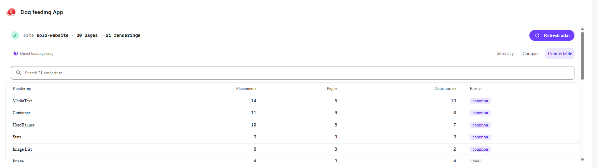
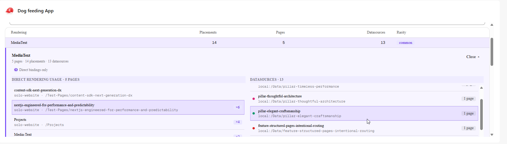
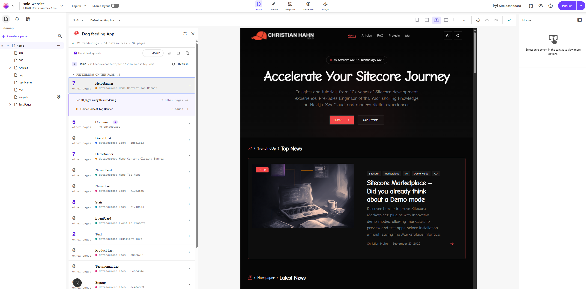
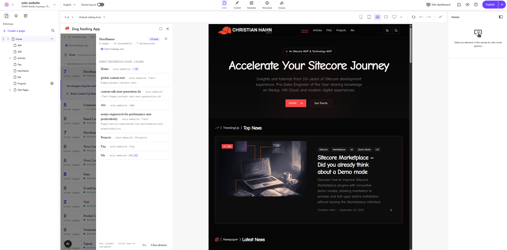

#  Component Usage Atlas

**Author:** [Christian Hahn](https://www.linkedin.com/in/christian-hahn-solo/) — _Technical Product Manager DevEx & SDKs @ Sitecore_

Tenant-wide live atlas of where renderings and their bound datasources are used across a Sitecore tenant — answering the *"if I publish, modify, or delete this, what else breaks?"* question without leaving Pages.

## What this is

A Sitecore Marketplace app (Mode A, no backend) that walks the tenant's SDK agent endpoints on demand and builds two in-memory views. The atlas is built fresh in the iframe heap, cached for the tab's lifetime, and discarded on tab close. No backend, no persisted index, no scheduled jobs.

Two surfaces ship from one app registration: a **Dashboard Widget** for component-centric search, and a **Page Context Panel** for page-centric impact analysis. PRD-001 adds **Atlas Snapshot Export** — portable JSON / CSV / HTML snapshots for diffing, sharing, and downstream tooling.

## Screenshots

Captured from a live XM Cloud tenant (solo-website, "Dog feeding App" registration).

### Dashboard Widget — `xmc:dashboardblocks`

Search-first table of every rendering, sorted by total placements. Click a row to inline-expand a two-pane detail block: pages on the left, datasources on the right with cross-row hover affinity.





### Page Context Panel — `xmc:pages:context-panel`

For the active page, lists every rendering with `+N other pages` counters. Identical placements collapse into one row with a `×N` badge. Clicking a row opens a per-rendering or per-datasource drawer.





## Quickstart

Prerequisites: Node 22+ and a working `npm`.

1. Install dependencies:
   ```bash
   cd site
   npm install
   ```

2. Start the dev server:
   ```bash
   npm run dev
   ```

3. Open a surface route directly — **not** the root (see [Local smoke-test rule](docs/operations.md#local-smoke-test-rule)):
   - `http://localhost:3000/widget` — Dashboard Widget
   - `http://localhost:3000/panel` — Page Context Panel

4. To exercise the real SDK handshake, install the app into Cloud Portal. See [docs/registration.md](docs/registration.md) for extension-point paths, required scopes, and registration instructions.

## Project structure

```
products/component-usage-atlas/
├── site/                          # Next.js app (App Router, Turbopack)
│   ├── app/widget/                # Dashboard Widget route entry
│   ├── app/panel/                 # Page Context Panel route entry
│   ├── components/atlas/          # Composed atlas primitives + export action cluster
│   ├── components/ui/             # Blok primitives (shadcn registry)
│   ├── core/                      # Framework-free engine modules
│   │   ├── scan-engine.ts         # Orchestrates tenant fan-out via SDK
│   │   ├── atlas-store.ts         # Module-singleton state + pub/sub
│   │   └── atlas/export/          # PRD-001 — Snapshot Export module
│   └── lib/sdk/                   # SDK boundary: client, typed queries, domain types
├── pocs/                          # UI variant clickdummies (visual ground truth)
├── docs/                          # Architecture, decisions, features, operations
├── project-planning/              # PRDs, ADRs, runbooks (build-process record)
├── README.md
└── CHANGELOG.md
```

## Configuration

The app uses no `.env` file in production — all SDK context is injected by the Cloud Portal host frame at runtime. For local development, `NEXT_PUBLIC_SHOW_THEME_TOGGLE=true` enables a local theme toggle (not shown in the portal).

## Tech stack

- **Next.js 16.1.7** (App Router, Turbopack) + **React 19.2** + **TypeScript** (strict)
- **Tailwind CSS v4** + **Blok** (Sitecore design system, Nova preset via shadcn registry)
- **`@sitecore-marketplace-sdk/client@0.3.2`** + **`@sitecore-marketplace-sdk/xmc@0.4.1`** (pinned)
- **Vitest 4.x** + **@testing-library/react** — covering scan engine, atlas state, surface composition, drawers, export format adapters, and SDK fixtures with `// source:` provenance per `40-sdk-contracts.mdc`. Run `npm run test` for the live count.
- **Mode A iframe-only** — no backend, no persistence, no external network egress.

## Where to read more

- [Architecture overview](docs/architecture.md) — system structure, scan engine, state model, SDK boundary, telemetry, routing
- [Architectural decisions](docs/decisions.md) — themed ADR summary (21 ADRs, PRD-000 + PRD-001)
- [Atlas Snapshot Export](docs/features/snapshot-export.md) — format types, action cluster, filename convention, module layout, known limitations
- [Operations](docs/operations.md) — local smoke-test rule, CI commands, network egress rule, accepted caveats
- [Cloud Portal registration](docs/registration.md) — extension-point paths, required scopes, role, smoke-test status
- [CHANGELOG](CHANGELOG.md) — full release history by PRD

## License / contact

License: **TBD** (no license selected yet).

Maintainer: see git log for current owners.
